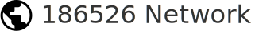

# 186526 Network

<!-- 
 -->

- AS200536, aka NET186.
- Experimental global network.
- Operated by 186526 (Bo Xu) [@real186526](https://186526.xyz), sponsored by Sunoaki Network LLC.

## Peering

186526 Network have an open peer policy. You can peer with us through our listed IX in [PeeringDB](https://www.peeringdb.com/net/31778) or through IP tunneling under IPv4.

Peering over RS is always recommended over direct sessions.

Documentation for the BGP Communities is [here](/communities).

For your convenience, here are more info about peering.

- ASN: `200536`
- AS-SET: [`AS-NET186`](https://git.186526.xyz/186526/net186-as-set#details-for-as-set)
- Suggested IPv6 Prefix limit: `500`

## Security Enforcement

186526 Network has implemented serveral policies to improve security, including:

1. IRR Filter - Our system will automatically retrieve ASN & IP list from IRRDB (RIPE,ARIN,APNIC,AFRINIC,LACNIC) using bgpq4. [^1]

2. RPKI Filter - Our system will validate RPKI information from Cloudflare. We will drop invalid prefix.

[^1]: Due to security and trust issues, we do not support AS-SET from RADB/ALTDB or other IRRDBs.

### Transit

AS200536 can provide free transit in some places. If you want to know more, please feel free to ask us.

## Contact

To get in touch with me, please send mail to the following mailboxes.

- Abuse: `abuse@186526.xyz`
- NOC: `noc@186526.xyz`

<!-- ## AS112 Project

We operate an AS112 server in Seattle, WA, which is IPv6 only.
It uses CoreDNS as DNS server software.

Unicast IPv6: `2a06:a005:2924::112`

The server is provided Transit by AS200536 and establish BGP Session with Route Server of MoeIX SEA.
If you want to peering with this server, please contact `noc@186526.xyz`. -->

## About Sunoaki Network LLC

Sunoaki Network LLC is a limited liability company registered in Colorado, United States. We provide IP leasing and IP Transit services. If you have any requirements, please contact `i@186526.xyz`.

Sunoaki Network LLC is a member of ARIN.
